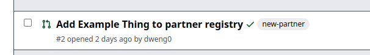
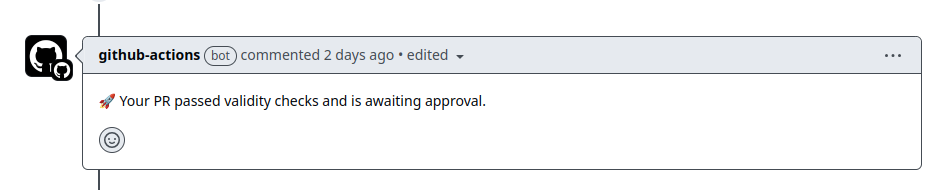
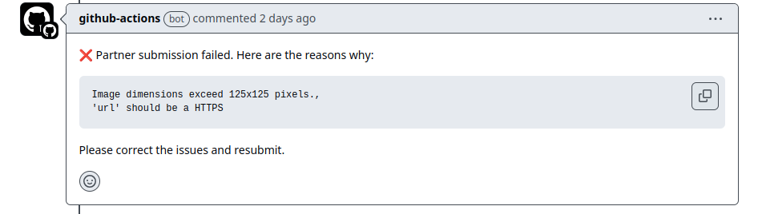

# ECOSYSTEM Partner Registry

How to add your project to our [Partner-Registry](https://github.com/autonity/partner-registry) repo.

## Adding your project to the Partner Registry

Firstly you need to fork the registry [repo](https://github.com/autonity/partner-registry), clone it locally and open in your favorite editor.

#### Step 1: Select the `partners/` folder.

#### Step 2: In the `partners/` folder create a folder named according to your project.

#### Step 3: In your project folder you need to add three files: `thumbnail.png`, `banner.png` & `info.yaml`.

The `info.yaml` file looks like this:

```yaml
name: 'Partner' # 20 characters max
short_description: 'A short description' # 60 character max description
long_description: 'A long description used when the partner is featured' # 175 character max
tags: # max 3 tags, the most relevant should be listed first
    - 'defi' # no more then 12 characters per tag
    - 'infra'
url: 'https://www.autonity.org' # must be a valid https url
```

**Notes**

-   The `thumbnail.png` must be no more than 196x160px.
-   The `banner.png` must be no more than 274x105px.
-   Tags should be added in order of relevance! The most relevant tag should be the first.

#### Step 4: Create a pull-request containing your updated data.

#### Step 5: Submit Your Pull Request

**When you submit your PR, please use the following naming convention for the title:**

-   **Title Format**: `Add <Project Name> to Partner Registry`
-   **Example**: `Add MyProject to Partner Registry`

If you are successfull, your PR will have a `new-partner` label applied to it:



And a success comment



If your PR failed validity checks, a bot will comment on the reasons why


